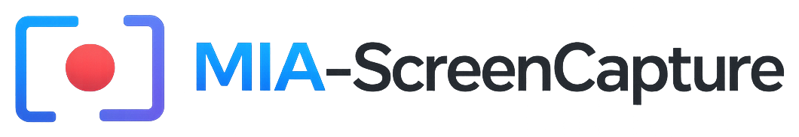

<div align="center">

<picture>
  <source media="(prefers-color-scheme: dark)" srcset="docs/assets/logo-dark.png">
  
</picture>

# MIA-ScreenCapture v1.4.9

**Professional screen recorder for Windows — GUI, REST API, WebSocket, scheduler, and CLI in one tool.**

[🇬🇧 English](README.md) · [🇷🇺 Русский](README.ru.md)

[](https://github.com/chelslava/MIA-ScreenCapture/actions/workflows/ci.yml)
[](https://github.com/chelslava/MIA-ScreenCapture/tags)
[](https://www.python.org/)
[](https://learn.microsoft.com/en-us/windows/win32/winrt/windows-graphics-capture)
[](LICENSE)

</div>

---

> ⚠️ **Platform: Windows 10/11 only** — the project relies on the Windows Graphics Capture API.

## Table of Contents

- [Features](#features)
- [Requirements](#requirements)
- [Installation](#installation)
- [Quick Start](#quick-start)
- [CLI Reference](#cli-reference)
- [REST API](#rest-api)
- [Architecture](#architecture)
- [Configuration](#configuration)
- [Development](#development)
- [Troubleshooting](#troubleshooting)
- [Known Limitations](#known-limitations)
- [License](#license)

## Features

### 🎥 Capture
- Full screen, a specific window, or a rectangular region, via the **Windows Graphics Capture API**
- **Simultaneous multi-monitor recording** — one independent file per monitor
- **Hot-swap of the capture source** mid-recording, without stopping or losing frames
- Configurable frame rate (1–120 FPS)

### 🔊 Audio
- Microphone, system audio (loopback), both, or none
- Device selection through `sounddevice`

### 🛡️ Reliability
- Automatic **crash recovery**: if the FFmpeg process dies, recording continues into a new segment (up to 3 attempts) instead of being lost
- Segment size/duration limits with automatic rollover to a new file
- **Disk-space monitoring** with a graceful auto-stop before the volume fills up
- **Post-recording integrity verification** and automatic repair via FFmpeg/`ffprobe`
- Retry policy with exponential backoff around the FFmpeg writer
- **Single-instance guard** — a second launch brings the existing window to the front instead of fighting over the capture session

### 🖥️ GUI (PyQt6)
- Tabs: Capture, Audio, Video, Output, API, Scheduler, Diagnostics
- System tray icon, global hotkeys, keyboard-first navigation
- Pre-flight **readiness checklist** (FFmpeg, output path, window, microphone) before you can start recording
- Centralized theming layer and accessibility metadata on key controls
- Floating on-screen indicator over the active recording area

### 🌐 REST API (Flask + Waitress)
- Versioned routes under `/api/v1/*` (legacy `/api/*` kept for compatibility)
- API key authentication (`X-API-Key` header or `Authorization: Bearer`)
- `Idempotency-Key` support for safe POST retries
- Sliding-window rate limiting and a circuit breaker around capture operations
- Uniform error contract with `trace_id` / `X-Request-ID`
- Interactive **Swagger UI** at `/api/docs`
- Observability endpoints: request metrics and SLO baseline

### 📡 WebSocket & Webhooks
- `ws://host:port/ws` — real-time `recording` / `system` / `api` / `metrics` events, with heartbeat and auto-reconnect
- **HMAC-signed webhook** notifications for recording lifecycle events

### ⏱️ Scheduler (APScheduler)
- One-off, daily, weekly, interval, and cron-based recording jobs
- CLI-compatible presets, next-run preview, per-task enable/disable

### ⌨️ CLI & Headless mode
- Start/stop/status, full scheduler CRUD, presets
- `--headless` runs the API server only, with no GUI

## Interface Preview

### 📸 Visual Layout

```
┌─────────────────────────────────────────────────────────────────┐
│  MIA-ScreenCapture v1.4.9                               [_][□][×] │
├──────────┬───────────────────────────────────────────────────────┤
│ 📹 Record│  🎯 Full Screen  🪟 Window  📐 Region                │
│ ⚙️ Settings│  ┌─────────────────────────────────────────────┐  │
│ 📅 Scheduler│  │ Preview: Area Selector Overlay             │  │
│ 📡 API    │  │ (Live capture area visualization)          │  │
│ 🔍 Diagnostics│  │                                             │  │
│           │  └─────────────────────────────────────────────┘  │
│           │  ▶ Start   ⏸ Pause   ⏹ Stop                       │
│           │  Duration: 00:00:15  Status: Recording...         │
│           │                                                   │
│           │  [Recent Recordings]                             │
│           │  ✓ 2026-06-24_150530.mp4 (2:34)                  │
│           │  ✓ 2026-06-24_143012.mp4 (5:12)                  │
└──────────┴───────────────────────────────────────────────────────┘
  System Tray: ▶ ◆ (Recording Indicator)
```

### 🎨 GUI Components

**Recording Tab** — Main interface for screen capture:
- Capture mode selector (full screen, window, or region)
- Live preview and area selector overlay
- Start/Stop/Pause controls
- Real-time recording duration and statistics

**Settings Tab** — Audio and video configuration:
- Microphone and system audio device selection
- Video codec, bitrate, and FPS settings
- Output path and file naming
- Theme selection (light, blue, dark, dark-contrast)

**Scheduler Tab** — Recording automation:
- Schedule tasks (one-off, daily, weekly, cron)
- Task management with enable/disable toggles
- Filter and search for scheduled tasks
- Next-run time preview

**API Tab** — REST API key management:
- Generate and rotate API keys
- API documentation link
- Base URL configuration

**Diagnostics Tab** — System health check:
- FFmpeg availability and version
- Audio device status
- Disk space monitoring
- Windows Graphics Capture API status

### 📱 Tray Icon & Overlay

- **System tray icon** with quick actions (start/stop/show/hide)
- **On-screen recording indicator** — floating overlay showing recording area and elapsed time
- **Global hotkeys** — Ctrl+Alt+T (toggle), Ctrl+Alt+P (pause)

### 🎯 Workflows

1. **GUI Recording** — Point-and-click interface, start/stop via buttons or hotkeys
2. **Scheduled Recording** — Create tasks for automated unattended recording
3. **REST API** — Remote control via HTTP endpoints (programmatic)
4. **CLI** — Command-line interface for automation scripts
5. **Headless Mode** — API server only, no GUI window

## Requirements

| Requirement | Value |
|---|---|
| OS | Windows 10/11 (Windows Graphics Capture API) |
| Python | 3.11+ |
| FFmpeg | Must be available on `PATH` |
| Package manager | [uv](https://docs.astral.sh/uv/) (recommended) or pip |

## Installation

### Option 1 — uv (recommended)

```bash
git clone https://github.com/chelslava/MIA-ScreenCapture.git
cd MIA-ScreenCapture

# Install uv if you don't have it yet
powershell -ExecutionPolicy ByPass -c "irm https://astral.sh/uv/install.ps1 | iex"

# Create the venv and install dependencies
uv sync                # all dependencies, including dev
uv sync --no-dev        # production only
```

### Option 2 — pip

```bash
git clone https://github.com/chelslava/MIA-ScreenCapture.git
cd MIA-ScreenCapture

python -m venv .venv
.venv\Scripts\activate

pip install -r requirements.txt        # production
pip install -r requirements-dev.txt    # + dev tools
```

### Verify FFmpeg

```bash
ffmpeg -version
```

If it's missing, install it from the [official site](https://ffmpeg.org/download.html) and add it to `PATH`.

## Quick Start

### GUI (default)

```bash
uv run python main.py
```

### CLI

```bash
# Start recording with defaults
uv run python main.py --start

# Record a rectangular region
uv run python main.py --start --area rect --rect 100 100 800 600

# Record with microphone audio, 60 seconds
uv run python main.py --start --audio mic --duration 60

# Stop / status
uv run python main.py --stop
uv run python main.py --status
```

### Scheduler

```bash
# Daily recording at 09:30
uv run python main.py --schedule-create --trigger daily --time "09:30" --audio mic --duration 1800

# Weekdays at 14:00
uv run python main.py --schedule-create --trigger weekly --time "14:00" --days "0,2,4" --audio both

# Apply a built-in preset
uv run python main.py --schedule-create --preset workday-morning
uv run python main.py --list-presets

# Manage tasks
uv run python main.py --schedule-list
uv run python main.py --schedule-update TASK_ID --time "10:00"
uv run python main.py --schedule-toggle TASK_ID --enabled false
uv run python main.py --schedule-delete TASK_ID
uv run python main.py --schedule-preview
```

### Headless (API only)

```bash
uv run python main.py --headless
```

## CLI Reference

| Flag | Description | Default |
|---|---|---|
| `--gui` | Run with the GUI | yes |
| `--headless` | Run without the GUI (API only) | – |
| `--start` / `--stop` / `--status` | Recording control | – |
| `--area` | `full`, `window`, or `rect` | `full` |
| `--rect X1 Y1 X2 Y2` | Rectangle coordinates | – |
| `--window TITLE` | Window title to capture | – |
| `--monitor INDEX` | Monitor index for `full` capture | primary |
| `--audio` | `mic`, `system`, `both`, or `none` | `none` |
| `--output PATH` | Output file path | auto |
| `--fps FPS` | Frames per second | `30` |
| `--codec CODEC` | Video codec | `libx264` |
| `--bitrate RATE` | Bitrate | `2M` |
| `--cursor` | Show the cursor in the recording | off |
| `--duration SECONDS` | Recording duration | unlimited |
| `--api-host` / `--api-port` | API bind address | `127.0.0.1` / `5000` |
| `--no-api` | Disable the API server | – |
| `--version` | Print the installed version | – |

Run `python main.py --help` for the full list, including all scheduler subcommands.

## REST API

The API listens on `http://127.0.0.1:5000` by default. All endpoints (except `/health`) require an API key via the `X-API-Key` header or `Authorization: Bearer`. Versioned endpoints live under `/api/v1/*`; legacy `/api/*` aliases are kept for backward compatibility.

Full reference with request/response schemas: [`docs/API.md`](docs/API.md). Interactive docs: `GET /api/docs` (Swagger UI) while the server is running.

### Endpoint groups

| Group | Examples | Purpose |
|---|---|---|
| Health | `GET /health` | Liveness check, no auth required |
| Recording | `POST /api/v1/start`, `stop`, `pause`, `GET status` | Core recording control |
| Hot source switch | `POST /api/v1/recording/switch-source` | Change capture source without stopping |
| Multi-monitor | `POST /api/v1/recording/start-multi`, `stop-multi`, `GET status-multi` | Simultaneous per-monitor recording |
| Recordings | `GET /api/v1/recordings`, `POST recordings/verify`, `recordings/repair` | History, integrity check, repair |
| Scheduler | `GET/POST /api/v1/schedule`, `PUT/DELETE .../<id>`, `POST .../<id>/toggle` | Scheduled job CRUD |
| Resources | `GET /api/v1/devices`, `windows`, `resources/monitors`, `resources/disk-space` | Audio devices, windows, monitors, disk space |
| Webhooks | `GET/POST /api/v1/config/webhook`, `POST .../test` | HMAC-signed event notifications |
| Events | `GET /api/v1/events/recent`, `events/stats` | Polling-friendly event history |
| Observability | `GET /api/v1/observability/metrics`, `observability/baseline`, `circuit-breakers` | RPS, latency, SLO baseline, breaker state |
| Config | `GET/PUT /api/v1/config` | Read/update runtime configuration |
| WebSocket | `ws://host:port/ws` | Real-time event stream with heartbeat |

### Error format

```json
{
  "success": false,
  "error": {
    "code": "validation_error",
    "message": "Request validation failed",
    "details": [
      {"field": "fps", "message": "Input should be less than or equal to 120", "type": "less_than_equal"}
    ]
  },
  "trace_id": "a1b2c3d4e5f6478a9b0c1234567890ab"
}
```

`trace_id` is duplicated in the `X-Request-ID` response header. Successful responses use `{"success": true, "data": {...}}`.

### curl examples

```bash
# Start a recording
curl -X POST http://localhost:5000/api/v1/start \
  -H "X-API-Key: your-api-key" -H "Content-Type: application/json" \
  -d '{"area":"full", "audio":"mic", "fps":30}'

# Status
curl -H "X-API-Key: your-api-key" http://localhost:5000/api/v1/status

# Create a cron schedule
curl -X POST http://localhost:5000/api/v1/schedule \
  -H "X-API-Key: your-api-key" -H "Content-Type: application/json" \
  -d '{
    "trigger": "cron",
    "day_of_week": "mon,wed,fri",
    "time": "15:00",
    "params": {"area": "window", "window_title": "Zoom", "audio": "system", "duration": 3600}
  }'
```

## Architecture

Layered architecture with a single public contract (`ApplicationFacade`, a `Protocol`) shared by the GUI, API, and CLI, and an `EventBus` for pub/sub notifications between them:

```
CLI / API / GUI
      │  commands
      ▼
ApplicationFacade (Protocol)
      │  orchestration
      ▼
ApplicationService
      ├── RecordingService  → RecordingBackend → recorder/
      ├── TaskScheduler     → APScheduler
      └── EventBus          → GUI / API / WebSocket / webhooks
```

```
api/            REST API: Flask routes, auth, rate limiting, idempotency,
                circuit breaker, WebSocket transport, Swagger
app_runtime/    Thin runtime coordinators between core/ and GUI/API
cli/            argparse-based CLI and scheduler subcommands
core/           Domain layer: event bus, DI container, lifecycle, facade
gui/            PyQt6 GUI (MVC: views/controllers/models, backends, styles)
recorder/       Physical capture: Windows Graphics Capture, sounddevice,
                FFmpeg encoding, crash recovery, segment rollover
scheduler/      APScheduler-based task scheduling and persistence
tests/          79+ unit tests, 11+ integration tests
```

## Configuration

Settings are persisted to `config/config.json`:

```json
{
  "video": { "fps": 30, "codec": "libx264", "bitrate": "2M", "format": "mp4" },
  "audio": { "record_mic": true, "sample_rate": 44100, "channels": 2 },
  "api": { "enabled": true, "host": "127.0.0.1", "port": 5000, "api_key": null }
}
```

The API key can also come from the `MIA_API_KEY` environment variable or Windows Credential Manager (target name `MIA-ScreenCapture/APIKey`).

## Development

```bash
uv sync                                    # install dev dependencies

uv run pytest                              # all tests
uv run pytest tests/unit/                  # unit tests only
uv run pytest --cov=. --cov-report=html    # with coverage

uv run ruff check .                        # lint
uv run ruff format .                       # format
uv run mypy .                              # type-check
```

Pre-commit hooks (ruff, mypy) are configured in `.pre-commit-config.yaml`:

```bash
uv run pre-commit install
```

## Troubleshooting

**FFmpeg not found** — confirm `ffmpeg -version` works and FFmpeg is on `PATH`.

**No audio in the recording** — check the system microphone settings, pick the correct input device in the GUI, and confirm a loopback/"Stereo Mix" device exists for system audio.

**Encoding errors** — check free disk space, confirm FFmpeg is installed correctly, and inspect `logs/recorder.log`.

## Known Limitations

- Windows 10/11 only (Windows Graphics Capture API dependency)
- Some DRM-protected windows cannot be captured
- System audio capture requires a loopback ("Stereo Mix") device
- No RTMP/HLS streaming or cloud storage integration

See [`CHANGELOG.md`](CHANGELOG.md) for the full history and [GitHub Issues](https://github.com/chelslava/MIA-ScreenCapture/issues) for the roadmap.

## License

[MIT](LICENSE)

## Author

Vyacheslav Chelischev — [@chelslava](https://github.com/chelslava)
